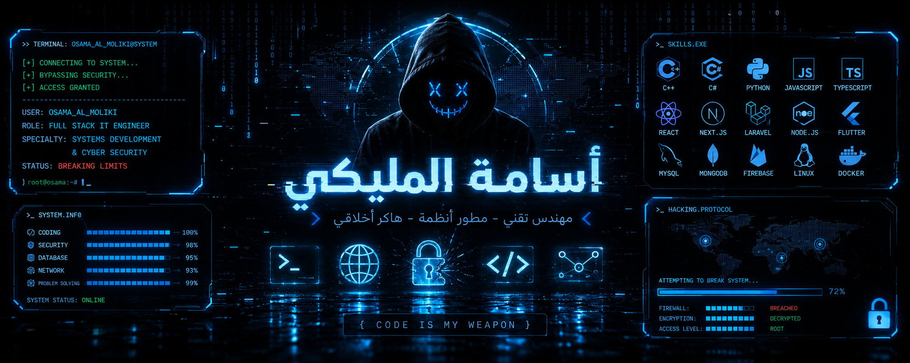

<div align="center">



# 

[](https://github.com/os-omdh-os)
[](https://github.com/os-omdh-os)

</div>
# 🖥️ SYSTEM.INFO

```bash
> whoami

Name        : Osama Al-Moliki
Role        : Full Stack IT Engineer
Location    : Sana'a, Yemen
Speciality  : Backend Architecture & Secure Software Engineering
Focus       : System Design, APIs, Infrastructure & Cybersecurity
Mission     : Architecting technology that is secure, scalable, and impactful.
```
